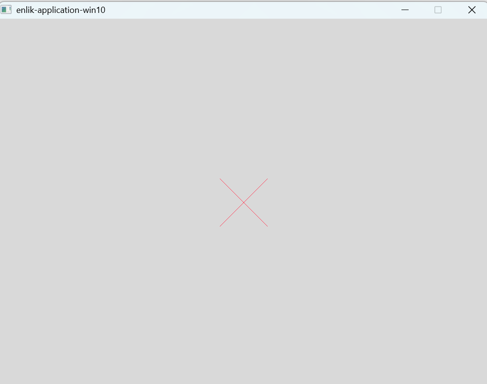

# 03.11.2025

Installation on Windows got this issue due to using of our company's laptop.

```
# /bin/bash -c "$(curl -fsSL https://codeberg.org/Umfeld/umfeld/raw/branch/main/install.sh)"
curl: (60) SSL certificate problem: unable to get local issuer certificate More details here: https://curl.se/docs/sslcerts.html 
curl failed to verify the legitimacy of the server and therefore could not establish a secure connection to it. To learn more about this situation and how to fix it, please visit the webpage mentioned above.
```


**Solution:**
https://copilot.microsoft.com/shares/SKbWy6v8jLx94HefQ6abu

#### 4. **Try with** `--insecure` **(not recommended)**

This bypasses certificate checks, but **only use it if you trust the source**:

bash

```
curl --insecure -fsSL https://codeberg.org/Umfeld/umfeld/raw/branch/main/install.sh |
```

installation log:

- [20251103_msys2_installation.log](logs/20251103_msys2_installation.log)
- [20251103_test_template_app_win10.log](enlik-application-win10/logs/20251103_test_template_app_win10.log)


Successful developing application using template:



# 26.10.2025

installation for macOS working smoothly, via MacMini M4 at home
